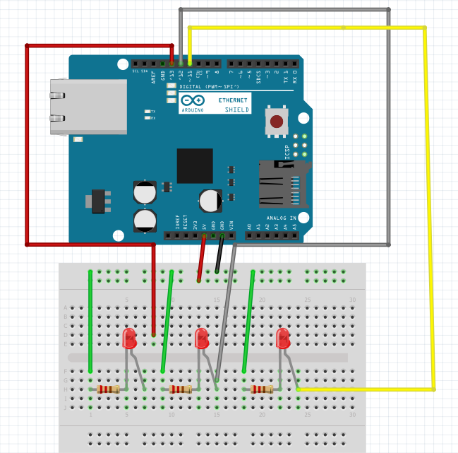

# RoboticArm

Η Ομάδα μας "Oι μικροί προγραμματιστές" αποτελείται από πέντε μαθητές 4ης δημοτικού.
Η ομάδα Θα κατασκευάσει ένα σταθερό ρομποτικό βραχίονα ο οποίος θα προγραμματιστεί να μεταφέρει μεταλλικά αντικείμενα από μία ή περισσότερες θέσεις σε μία άλλη.

Θα σχεδιαστεί και το πρωτότυπο θα κατασκευαστεί από χονδρό χαρτόνι. 

Στην συνέχεια η ομάδα θα επιλέξει το υλικό για την τελική φάση υλοποίησης, μεταξύ κόντρα πλακέ ή ακρυλικού υλικού.

Για την λειτουργία του έχει επιλεγεί ο μικροκοντρόλερ Arduino UNO, δύο Stepper motors, ένας ηλεκτρομαγνήτης, τρία Led, αντιστάσεις και καλώδια.

Ο προγραμματισμός του βραχίονα θα γίνει με την γλώσσα Arduino IDE.

Ο ρομποτικός βραχίονας θα λειτουργεί αυτόματα και θα συντονιστεί ώστε να συνεργάζεται με άλλον, όμοιο ρομποτικό βραχίονα για μεταφόρτωση των αντικειμένων.

Τα υλικά που θα χρησιμοποιηθούν είναι:

1) Arduino UNO
2) Δύο  (2) stepper motors με τους drivers
3) Ένας ηλεκτρομαγνήτης
4) Καλώδια και leds

Το κόστος της κατασκευής δεν ξεπερνάει τα 79,00 Ευρώ.  
**********************************************************************
Σάββατο 23-02-2019 

Η πρώτη φάση της εκπαίδευσης έχει ολοκληρωθεί. 
Οι μαθητές εκπαιδεύτηκαν στις βασικές έννοιες του προγραμματισμού με την γλώσσα IDE του Arduino Uno. 
Με την βοήθεια του Eργαστηρίου Rομποτικής (SensorLab38) έμαθαν να προραμματίζουν τους αισθητήρες και να ανάβοσβήνουν τα λαμπάκια (led και RGB led).

Παράλληλα με την βοήθεια του δασκάλου τους μελέτησαν και συζήτησαν για τον σχεδιασμό του ρομποτικού βραχίονα.

Από την συζήτηση διαπιστόθηκε ότι Υπήρχαν δύο προτάσεις σχετικά με τις λειτουργίες του βραχίονα. Ορισμένοι μαθητές πρότειναν ο βραχίονας να τοποθετηθεί πάνω σε μία πλαυφόρμα με ρόδες και να μετακινήται. Δηλαδή να φοτρώνει φορτία από το ένα μέρος και να τα αποθέτει σε ένα άλλο. 
Η άλλη πρόταση ήταν ο βραχίονας να να είναι σταθερός και να φορτώνει τα φορτία επό το έδαφος επάνω στην πλατφορμα.

Τελικά αποφασίστηκε η δεύτερη πρόταση διότι με την πρώτη πρόταση το έργο θα γινόταν ερκετά πολύπλοκο τόσο στην κατασκευή του ρομποτικού όσο και στην ανάπτυξη του κώδικα Άλλωστε η χρόνοε μέχρι την παράδοση του έργου στην επιτροπή διαγωνισμού δεν επαρκούσε.  

Η ομάδα θα συνεχίσει και μετά τον διαγωνισμό για να ολοκληρώση και την πρώτη πρόταση.

